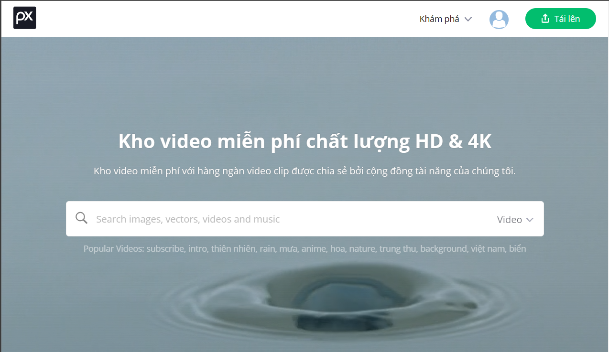
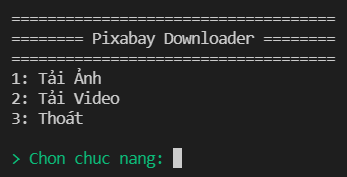
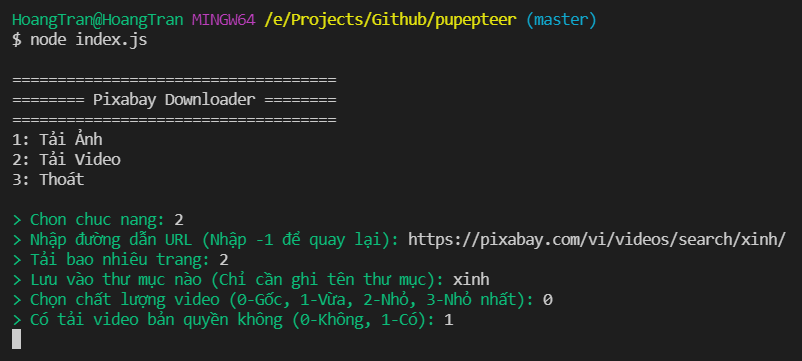
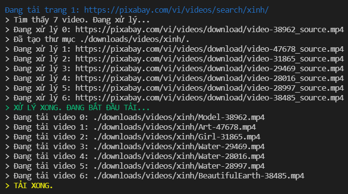
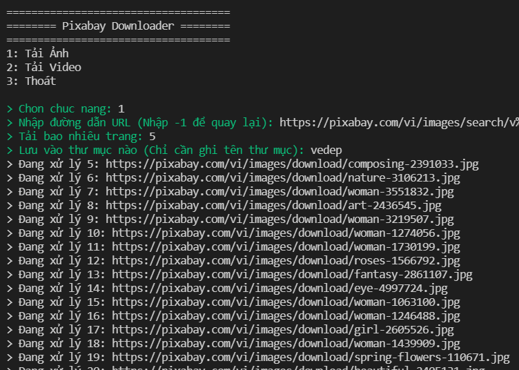
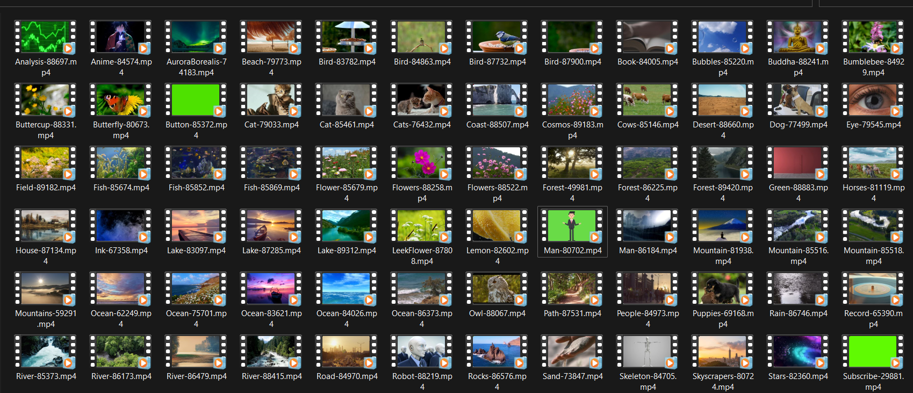

# AUTO MEDIA DOWNLOADER

Donate? Muốn hỗ trợ mình 1 ly cafe <3 [Donate here](https://github.com/HoangTran0410/HoangTran0410/blob/main/DONATE.md)

Tool tải ảnh/video tự động trên [pixabay](https://pixabay.com/)

Sử dụng thư viện [puppeteer](https://github.com/puppeteer/puppeteer) trong [Nodejs](https://nodejs.org/en/)

Chỉ cần tìm kiếm như bình thường trên pixabay, rồi copy paste đường link trang web vào tool là tool sẽ tải hết ảnh/video có trong trang web đó (và những trang tiếp theo nếu chọn chức năng tải nhiều trang liên tiếp).

Link ví dụ: https://pixabay.com/vi/videos/search/love/

## Cài Tool

- B1: Cài NodeJs, phiên bản 14 trở lên.
- B2: Tải code về (tải zip hoặc git clone).
- B3: Đăng nhập vào trang [pixabay](https://pixabay.com/) bằng tài khoản của bạn.
- B4: Cài đặt extension [Edit this cookies](https://chrome.google.com/webstore/detail/editthiscookie/fngmhnnpilhplaeedifhccceomclgfbg?hl=vi) để lấy cookie từ trang pixabay ở trên.
- B5: Dán cookie có được vào file [cookies.json](./cookies.json)
- B6: Mở cmd trong thư mục chứa code. Chạy câu lệnh _npm i_ để cài đặt tool

## Sử Dụng

- B1: Vẫn trong cửa sổ cmd, gõ _node index.js_ để chạy tool
- B2: Tool sẽ hiển thị menu cho người dùng lựa chọn chức năng

Các file ảnh/video được tải sẽ được lưu trong thư mục downloads bên trong thư mục của tool

## Screenshots

### TRANG CHỦ PIXABAY

### MENU

### TẢI VIDEO

## TẢI ẢNH

## KẾT QUẢ

